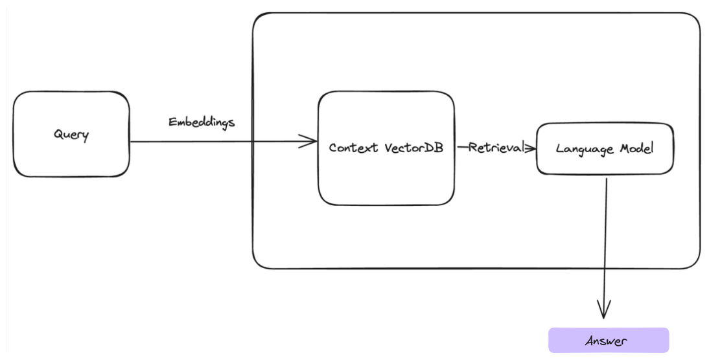

# **MedMini**

## _Runs within_  **< 3GB RAM | 0 vRAM**   
## _Inference Time_ **< 3 sec** 
### A Lightweight architecture for an Answering System on medical data based on LLMs, designed to run on **edge devices**. 
### Entirely on-device processing 
### Model Size on Disk: 500 + 250 MB 

## **Installation Instructions**

### **Quickstart - Docker** _Memory Heavy_
- Download the `docker.run.sh` file from the repository
- `sudo chmod +x docker-run.sh`
- `sudo ./docker-run.sh`

    **Uninstalling**
    - `sudo docker image rm medmini`

### **Raw Install** _Best Performance_
- `git clone https://github.com/sarthakchittawar/Medmini.git`
- `sudo chmod +x install.sh ; ./install.sh`
- `sudo chmod +x run.sh ; ./run.sh`
- _Need to have a ubuntu>=22.04 or debian>=12 based distro_

## **Future work**
1. Improve the RAG algorithm without compromising on efficiency
